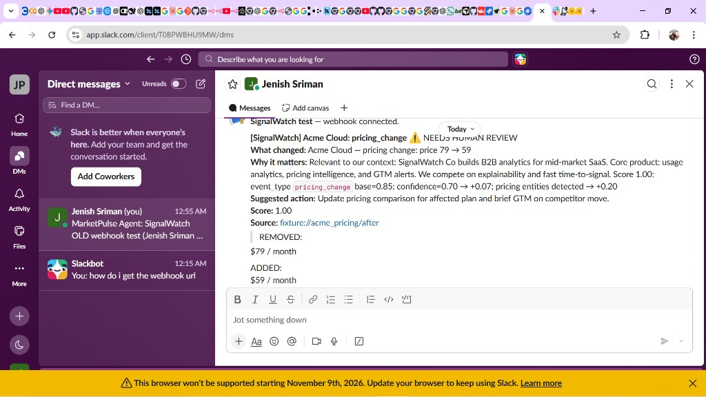
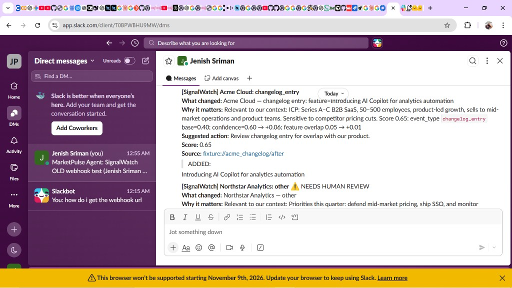

# SignalWatch

> Built SignalWatch, an agentic CI system (LangGraph + Playwright + FastAPI + pgvector) that diffs competitor pages into structured events, scores signal vs noise with explainable feedback learning, and sends source-grounded alerts with company-context RAG.

**SignalWatch** is a background competitive-intelligence agent — not a chatbot. It watches public competitor pages on a schedule, detects meaningful changes, scores importance against your company context, and sends sourced alerts with suggested actions. Human feedback (useful / meh / noise) updates scoring weights with small, capped, explainable deltas.

## Problem

Competitive intel is usually ad-hoc browser tabs and Slack lore. Teams miss pricing cuts, drown in changelog noise, or act on unverified rumors. SignalWatch automates the loop: **Sources → Signals → Safeguards**.

## Three pillars

1. **Sources** — public competitor pages (pricing, changelog, blog, product); polite rate limits; robots/ToS-aware; no authenticated scraping
2. **Signals** — structured events + explainable importance scoring; alert only above threshold (near-threshold → human review)
3. **Safeguards** — mandatory source links + quoted snippets; critic bans speculative FUD; audit log; policy config (allowed domains, max pages, login-path deny)

## Architecture

```text
┌─────────────┐   plan URLs    ┌──────────────────────────────────────────────┐
│  Scheduler  │───────────────▶│  LangGraph intel cycle                       │
│  (worker)   │                │  plan → collect → diff/extract → score/act   │
└─────────────┘                └───────┬──────────────────────▲───────────────┘
                                       │                      │ feedback
                    Playwright/httpx   │                      │
                    + fixture://       ▼                      │
                               ┌──────────────┐      ┌────────┴────────┐
                               │  Snapshots   │      │  Weights store  │
                               │  + Events    │      │  (capped Δ)     │
                               └──────┬───────┘      └─────────────────┘
                                      │
                    pgvector RAG      ▼
                               ┌──────────────┐     Slack / email / console
                               │ Company ctx  │────────────────────────────▶
                               └──────────────┘
                                      ▲
                               FastAPI + Streamlit UI (registry, traces, feedback)
```

### Core agent loop

1. Plan which competitor URLs to check  
2. Collect via httpx → Playwright fallback (or `fixture://` for demos/evals)  
3. Normalize + hash snapshots  
4. Cheap text diff; drop cookie/footer/date-only noise  
5. LLM/heuristic extraction on **changed sections only** → structured events  
6. Score (rules + importance factors + company-context RAG)  
7. Summarizer → critic (reject ungrounded / speculative claims)  
8. Act: Slack webhook and/or email (console fallback)  
9. Learn: feedback adjusts weights (visible before/after in UI)  
10. Persist run traces, audit log, cost/latency

## Stack (intentional)

| Dependency | Job |
|---|---|
| **LangGraph** | Orchestrate the intel cycle as an explicit graph |
| **Playwright + httpx** | Fetch JS-heavy and simple public pages |
| **Pydantic** | Event / alert / trace schemas |
| **PostgreSQL + pgvector** | Snapshots, events, alerts, embeddings (**Supabase**) |
| **FastAPI** | CRUD + trigger runs + feedback API |
| **Streamlit** | Fast control-plane UI (not a chat product) |
| **APScheduler** | Background scheduled runs |
| **OpenAI-compatible API** | Extract / summarize (DeepSeek, OpenAI, etc.; heuristics if no key) |

## Quick start

**Database:** [Supabase](https://supabase.com) Postgres + pgvector (set `DATABASE_URL` in `.env`).

```bash
# 1) Python env
python -m venv .venv
# Windows: .venv\Scripts\activate
# macOS/Linux: source .venv/bin/activate
pip install -e ".[dev]"
playwright install chromium

# 2) Config (never commit .env)
cp .env.example .env
# Set OPENAI_API_KEY + OPENAI_BASE_URL (e.g. DeepSeek: https://api.deepseek.com)
# Set SLACK_WEBHOOK_URL (optional — console fallback)
# Set DATABASE_URL from Supabase → Project Settings → Database → URI
#   use postgresql+psycopg:// ... and run: CREATE EXTENSION vector;

python -c "from packages.db.session import init_db; init_db()"

# 3) Seed + one intel cycle (Notion + Linear live pages)
python scripts/seed_demo.py --run-cycle
# Guaranteed offline alerts: python scripts/seed_demo.py --fixtures --run-cycle

# 4) API + UI
uvicorn apps.api.main:app --reload --port 8000
# other terminal:
streamlit run apps/web/app.py --server.port 8501
```

Or: `make demo` then `make api` / `make web`.

## Deploy on Streamlit Community Cloud

The UI can run **standalone** (inline backend + Supabase) — no separate FastAPI host required.

1. Push this repo to GitHub (do **not** commit `.env` or `.streamlit/secrets.toml`).
2. Go to [share.streamlit.io](https://share.streamlit.io) → **New app**.
3. Settings:
   - **Main file path:** `apps/web/app.py`
   - **Python version:** 3.11+
4. **Advanced settings → Secrets** — paste from `.streamlit/secrets.toml.example` and fill real values:
   - `DATABASE_URL` (Supabase, with `postgresql+psycopg://`)
   - `OPENAI_API_KEY` / `OPENAI_BASE_URL` / `OPENAI_MODEL`
   - `SLACK_WEBHOOK_URL`
   - `SIGNALWATCH_INLINE = "1"`
5. Deploy → open the public `*.streamlit.app` URL.
6. In the app: **Run intel cycle** (worker is not included on Streamlit Cloud free tier; use the button or an external cron later).

Local Streamlit without API:
```bash
set SIGNALWATCH_INLINE=1
streamlit run apps/web/app.py
```

## Example Slack alerts (live)

Real messages delivered by the agent:

**Pricing change (high signal → human review for critic grounding)**

```text
[SignalWatch] Acme Cloud: pricing_change ⚠️ NEEDS HUMAN REVIEW
What changed: Acme Cloud — pricing change: price 79 → 59
Why it matters: Relevant to our context: SignalWatch Co builds B2B analytics
  for mid-market SaaS… Score 1.00: event_type pricing_change base=0.85;
  confidence=0.70 → +0.07; pricing entities detected → +0.20
Suggested action: Update pricing comparison for affected plan and brief GTM
  on competitor move.
Score: 1.00
Source: fixture://acme_pricing/after
> REMOVED: $79 / month
> ADDED: $59 / month
```

**Feature / changelog signal**

```text
[SignalWatch] Acme Cloud: changelog_entry
What changed: Acme Cloud — changelog entry: feature=Introducing AI Copilot
  for analytics automation
Why it matters: Relevant to our context: ICP … Sensitive to competitor pricing
  cuts. Score 0.65: event_type changelog_entry base=0.40; confidence=0.60 → +0.06
Suggested action: Review changelog entry for overlap with our product.
Score: 0.65
Source: fixture://acme_changelog/after
> ADDED: Introducing AI Copilot for analytics automation
```

Screenshots:





## Learning loop (real, not faked)

1. Open **Alerts & feedback** in the UI  
2. Inspect **score breakdown BEFORE feedback**  
3. Click useful / meh / noise  
4. UI shows **weight deltas AFTER** (capped ±0.03, clamped to [0.05, 0.95])  
5. **Dashboard** chart tracks **% useful alerts over time**

## Eval harness

```bash
python evals/fixtures/generate_fixtures.py   # 28 before/after pairs + labels
python evals/run_eval.py                     # precision / recall / F1 + extraction
```

### Latest fixture results (`strategy=rules`, n=28)

| Metric | Score |
|--------|------:|
| **Precision** | **0.900** |
| **Recall** | **1.000** |
| **F1** | **0.947** |
| Event-type accuracy (positives) | 0.889 |
| Entity extraction score | 0.907 |
| Confusion | tp=18 · fp=2 · fn=0 |

Full machine-readable report: run the eval locally (report is gitignored).

### A/B scoring strategies on this suite

```bash
# Windows PowerShell
$env:SIGNALWATCH_SCORE_STRATEGY="rules"; python evals/run_eval.py
$env:SIGNALWATCH_SCORE_STRATEGY="rules_rag"; python evals/run_eval.py
```

Document the F1 delta in your write-up; promote the winner’s weight priors.

## Safeguards

- No login/auth path scraping (`/login`, `/signin`, `/auth`, …)  
- robots.txt checked; polite `User-Agent` + request delay  
- Alerts require source URL + quoted snippet  
- Critic strips banned speculative phrases  
- Audit log of every fetch  
- Policy: `max_pages_per_run`, thresholds via `.env`

## 2-minute demo script

1. `python scripts/seed_demo.py --run-cycle` — registers **Notion** + **Linear** (live pricing/changelog) and stores baselines  
   - For a guaranteed Slack alert offline: `python scripts/seed_demo.py --fixtures --run-cycle`  
2. Open Streamlit → **Competitors** — confirm Notion / Linear URLs  
3. **Runs & traces** — show fetch → diff → extract → score → critique → act  
4. **Alerts & feedback** — open score breakdown, mark useful / noise, show weight change  
5. `python evals/run_eval.py` — show precision/recall (target: F1 ≈ 0.95 on fixtures)

## Repo layout

```text
apps/api/             FastAPI
apps/worker/          APScheduler runner
apps/web/             Streamlit UI
packages/agent/       LangGraph graph, extract, summarize, actions
packages/connectors/  httpx / Playwright / fixture fetchers
packages/diffing/     snapshot diff + noise filters
packages/scoring/     weights + capped feedback updates
packages/rag/         company-context embeddings
packages/schemas/     Pydantic models
packages/policy/      safeguards
packages/db/          SQLAlchemy + pgvector
evals/                fixtures + harness
docs/screenshots/     demo screenshots
scripts/seed_demo.py
```

## Resume blurb

Built SignalWatch, an agentic CI system (LangGraph + Playwright + FastAPI + pgvector) that diffs competitor pages into structured events, scores signal vs noise with explainable feedback learning, and sends source-grounded alerts with company-context RAG. Fixture eval: **F1 0.947** (precision 0.90, recall 1.00).

## License

MIT (portfolio project).
